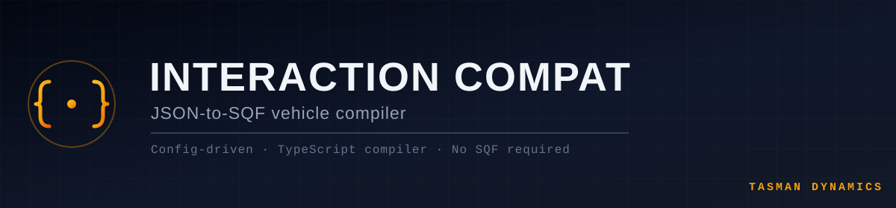

<div align="center">



[](https://arma3.com/)
[](https://github.com/A3-TasmanDynamics/TasDyn-Interaction-Framework)
[](https://www.typescriptlang.org/)
[](#️-status)
[](https://discord.gg/Wt4ahmxVrs)

</div>

---

**A Tasman Dynamics Developer Tool**

TasDyn-Interaction-Compat is the companion compiler for the
[Interaction Framework](https://github.com/A3-TasmanDynamics/TasDyn-Interaction-Framework) — the
Data Bus-driven 3D cockpit interaction engine for Arma 3. Instead of hand-writing SQF to wire a
vehicle's clickable switches, dials, and camera views into the Framework, modders describe the
vehicle declaratively in a JSON config. The compiler parses it, validates it, and generates the
injection code that hooks the vehicle in — no SQF required.

---

## ⚙️ How It Works

<table>
<tr>
<td width="33%" valign="top">

### 📝 Declare
Describe a vehicle's memory points, camera views, and interactive elements (toggles, buttons,
knobs) in a single JSON file — no scripting knowledge needed.

</td>
<td width="33%" valign="top">

### 🔧 Compile
The TypeScript compiler (`compiler/src/compiler.ts`) recursively reads every config under
`compiler/configs/`, validates its structure, and generates the corresponding injection code.

</td>
<td width="33%" valign="top">

### 🔌 Hook In
Generated code is written to `addons/tasdyn_compat/`, ready to build into a PBO that plugs the
vehicle straight into the Interaction Framework.

</td>
</tr>
</table>

## 📋 Config Schema

Each vehicle config declares:

| Field | What it does |
|---|---|
| `vehicleClass`, `author`, `version` | Identifies the vehicle and who compiled it |
| `cameraViews[]` | Named camera positions (`viewID`, `cameraPosNode`, `cameraTargetNode`, `fov`) for cockpit look-around |
| `interactions[]` | Clickable elements — `type: toggle \| button \| knob`, bound to a `memoryPoint`, `radius`, `animation`, `states`, and tooltip `label` |

Configs are organized by source under `compiler/configs/` — e.g. `vanilla/`, `rhs/` — so
contributors can group submissions by the mod they're adding compatibility for.

## 🧰 Usage

### 👨‍💻 Compiling Configs

```bash
cd compiler
npm install
npm run build   # runs ts-node src/compiler.ts
```

The compiler reads every `*.json` under `compiler/configs/` and writes generated output to
`addons/tasdyn_compat/`.

### ✍️ Adding a New Vehicle

1. Create a JSON file under `compiler/configs/<source>/` (e.g. `compiler/configs/rhs/`) following
   the schema above — see `compiler/configs/vanilla/B_Heli_Light_01_F.json` for a working example.
2. Run the compiler.
3. Submit a pull request with your config — no SQF changes needed.

## ✅ Supported Sources

* ✅ Vanilla Arma 3 Aircraft
* ✅ RHS Vehicles
* 🔜 CUP Vehicles
* 🔜 Community Add-ons

## 🔗 Related Projects

| Project | Role |
|---|---|
| [TasDyn-Interaction-Framework](https://github.com/A3-TasmanDynamics/TasDyn-Interaction-Framework) | The runtime engine this compiler generates compatibility code for |

## 🗓️ Status

**Early development.** The compiler pipeline (JSON → TypeScript → generated addon) is functional
for vanilla and RHS test vehicles. CUP and broader community-addon coverage are planned as configs
are contributed.

## 📜 License

The compiler tool itself is released under the **ISC License**. Generated Arma 3 addon output
follows the **Arma Public License Share Alike (APL-SA)**, consistent with the rest of the Tasman
Dynamics Interaction ecosystem.

---

<div align="center">

Want to add compatibility for a vehicle? [Join the Tasman Dynamics Discord](https://discord.gg/Wt4ahmxVrs).

</div>
